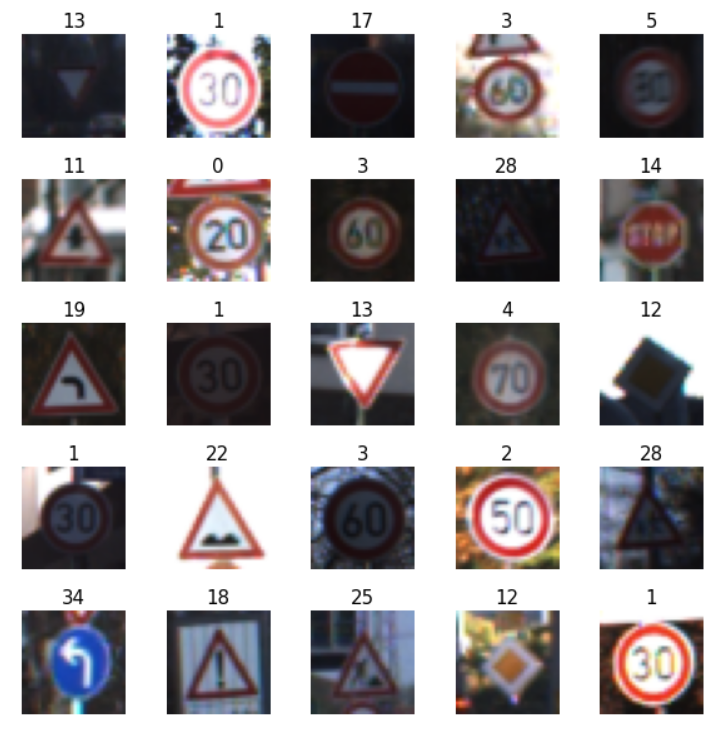
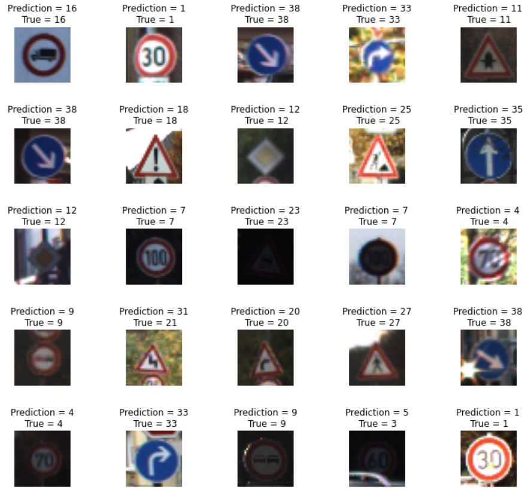

# Traffic-Signal-Classification

I build this model with the help of Google Colab. This is really an awesome tool by google for all Data Science enthusiast. If you don't know about Google Colab learn about it [here](https://colab.research.google.com/notebooks/intro.ipynb).

Data used in model looks like this 👇

Model prediction output with images 👇

Dataset consists of total 43 different categories to classify. Below are the list of categories with the corresponding numbers.

  - 0 = Speed limit (20km/h) 
  - 1 = Speed limit (30km/h)
  - 2 = Speed limit (50km/h) 
  - 3 = Speed limit (60km/h)
  - 4 = Speed limit (70km/h) 
  - 5 = Speed limit (80km/h)
  - 6 = End of speed limit (80km/h)
  - 7 = Speed limit (100km/h)
  - 8 = Speed limit (120km/h)
  - 9 = No passing
  - 10 = No passing for vehicles over 3.5 metric tons
  - 11 = Right-of-way at the next intersection
  - 12 = Priority road
  - 13 = Yield
  - 14 = Stop
  - 15 = No vehicles
  - 16 = Vehicles over 3.5 metric tons prohibited
  - 17 = No entry
  - 18 = General caution
  - 19 = Dangerous curve to the left
  - 20 = Dangerous curve to the right
  - 21 = Double curve
  - 22 = Bumpy road
  - 23 = Slippery road
  - 24 = Road narrows on the right
  - 25 = Road work
  - 26 = Traffic signals
  - 27 = Pedestrians
  - 28 = Children crossing 
  - 29 = Bicycles crossing
  - 30 = Beware of ice/snow
  - 31 = Wild animals crossing
  - 32 = End of all speed and passing limits
  - 33 = Turn right ahead
  - 34 = Turn left ahead
  - 35 = Ahead only
  - 36 = Go straight or right
  - 37 = Go straight or left
  - 38 = Keep right
  - 39 = Keep left
  - 40 = Roundabout mandatory
  - 41 = End of no passing
  - 42 = End of no passing by vehicles over 3.5 metric tons

### Run local

**Step 1**: Dowload the dataset from [here](https://drive.google.com/drive/folders/18g-6yMJMIuQRr5x7-QfExz8cImXQ-HOg?usp=sharing). And save it into the folder name as *dataset*.

**Step 2**: Fork and Clone the repository. Paste the downloaded dataset into the forked repository.

**Step 3**: Upload the forked repository into your Google drive.

**Step 4**: Open the *.ipynb* file with *Google Colaboratory*

Congratulations! You are done. Run the *notebook* locally into your *google colab*.

**_Need help?_** 
**_Feel free to contact me @ [premchandra.singh.5268@gmail.com](mailto:premchandra.singh.5268@gmail.com?Subject=Traffic-Signal-Classification)_**
